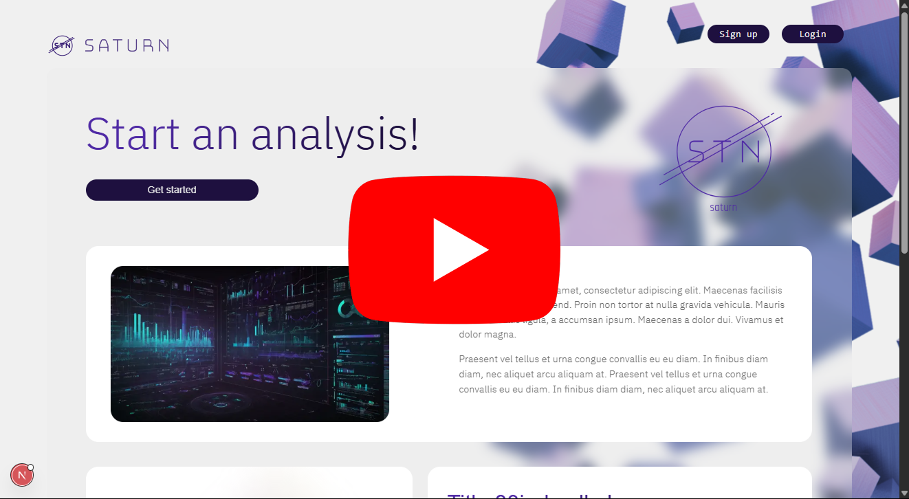

# Executive Report

## Summary

Index|Topics
---|---
| 1) | [Project](#1-project)
| 2) | [Development](#2-development)
| 3) | [Interface](#3-interface)
| 4) | [Metrics](#4-metrics)
| 5) | [Next Steps](#5-next-steps)

## 1) Project

The proposed project aims to develop an innovative cloud-based data analysis platform that enables small businesses to perform data analysis in a simple and efficient manner. With a strong focus on accessibility for users without technical backgrounds, the platform allows users to generate charts, reports, and export data in various formats, thereby democratizing access to data analysis. This is particularly relevant in fields such as business, administration, and marketing, where the ability to interpret and share information effectively is essential for strategic decision-making.

In addition to its technological foundation, the project will adopt a subscription-based business model, offering plans tailored to different user needs. The system architecture is optimized to operate on a limited budget while maintaining the flexibility to scale and adapt to future growth. This approach ensures that even small companies have access to powerful data analysis tools, promoting digital inclusion and strengthening their ability to compete in an increasingly data-driven market.

## 2) Development

The development of the first version of the system was structured into five biweekly sprints. Each sprint delivered specific results, as described below.

### 2.1) Sprint 1

During the first sprint, the following items were delivered:

- **TAPI (Project Opening Term of Inteli):** A document completed through a form that provides a detailed explanation of the developed application. It also describes the pain points the solution addresses and its target audience.

- **Project Plan:** Comprehensive documentation outlining how the solution would be developed, including technical specifications, delivery timeline, stakeholder descriptions, and role assignments within the development team.

- **Functional and Non-Functional Requirements:** Description of the functional requirements (expected system features) and non-functional requirements (system-level specifications and business metrics), as well as architectural composition.

### 2.2) Sprint 2

- **System Architecture:** A clear schematic of the main components of the application, their responsibilities, and how they communicate with each other, modeled using the C4 framework.

- **System Interface:** The creation of wireframes and interactive prototypes helped validate the platform's interaction flow and layout. Front-end development was then initiated using ReactJS, emphasizing responsiveness, usability, and accessibility.

- **Style Guide:** The style guide defined the main design guidelines for the application, establishing visual standards such as typography, color palette, spacing, and reusable components. It ensured visual consistency and served as a reference for development, streamlining collaboration between design and code in future sprints.

### 2.3) Sprint 3

- **Supabase Configuration:** Supabase was selected as the backend solution, providing database, authentication, and file storage functionalities based on PostgreSQL. The initial setup included project creation, permission settings, and integration with the development environment.

- **Database Configuration:** Creation of essential tables according to the previously defined data model.

- **JSON Formatting:** Definition and formatting of the JSON structure to be used for storing and exchanging data within the application. This format was adopted to represent uploaded files, chart configurations, and project metadata, ensuring clarity and flexibility in processing and visualizing information.

### 2.4) Sprint 4

- **Front-End and Supabase Integration:** Established communication between the application's front-end and the database. This included implementing file reading, upload, and CRUD operations on database records.

- **Graph Functionality Implementation:** Completed the functionality that allows users to upload files and visualize their data through different types of charts (scatter, bar, pie). Automatic data parsing, column mapping for chart axes, and project/graph naming customization were implemented.

### 2.5) Sprint 5

- **Code Refinement:** Final adjustments and improvements were made to the source code.

- **Executive Report:** Preparation of the current documentation.

## 3) Interface

The user interface was developed based on the style guide. The first version of the prototype can be accessed at the following link:  
*Insert link here*

## 4) Metrics

By the end of the first version, the following metrics were achieved:

- 5 developed pages;
- 21 components created;
- Approximately 40 hours of development work;
- 1,584 lines of code written (including pages, components, and middleware);
- 3 official documents completed.

## 5) Next Steps

In the next development cycle, the focus will be on application security. More robust mechanisms will be implemented to ensure platform reliability. Deliverables for the next phase include:

- **Security System Architecture:** Architectural design for the security components to be implemented in the system.

- **LGPD Compliance, Privacy, and Regulation Analysis:** Documentation of privacy policy and identification of applicable topics from Brazil’s General Data Protection Law (LGPD) to be implemented or respected.

- **Monitoring and Security Logs Implementation:** Development of a logging system to enable tracking and automation of alerts.

- **Analytical Reports Generation:** Documentation and analysis of system logs to monitor platform performance.

- **Security Solutions Implementation:** Implementation of protective measures such as multi-factor authentication, data protection strategies, firewalls, encryption, and other relevant security techniques.

- **Detailed Submission Plan:** Documentation outlining submission processes, KPIs, success metrics, and justifications.

- **Official Implementation Documentation:** A technical document detailing the technologies and strategies adopted to enhance system security.

- **Final Presentation.**
