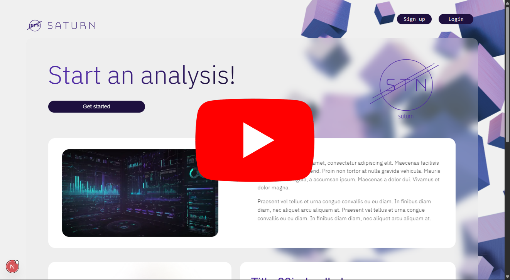
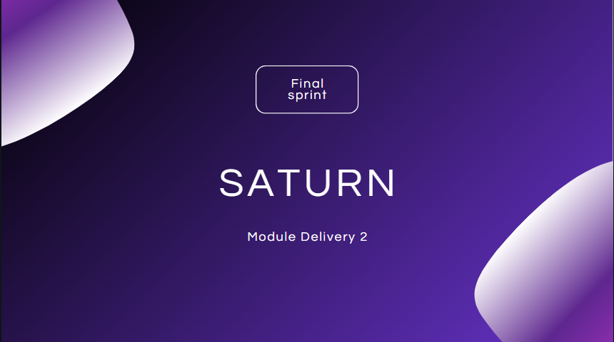

# Public Report

## 🏁 Sprint 1: Planning and Documentation

Period: [April 21 - May 02]

Sprint Goal: Define establish initial documentation, define security architecture, and plan next development steps.

✅ Achieved Results:
- Scope Definition : Main features and system objectives were mapped.
- System Architecture : Defined base security architecture.
- Initial Documentation : Created repository with README and the project's planner.
- Planning for Next Sprints : Tasks were divided and prioritized for upcoming technical goals.

## 🔐 Sprint 2: Login Implementation

Period: [May 05 - May 16]

Sprint Goal: Implement user authentication into the system, integrating with Supabase.

✅ Achieved Results:
- Login Implementation : User login and authentication features were implemented using Supabase integration.
- The authentication process was tested and validated, ensuring users can securely access the system.
- Correct configuration of endpoints and authentication flows was carried out to ensure compatibility with the backend.

## 🧪 Sprint 3: Static Code Analysis

Period: [May 19 - May 30]
Sprint Goal: Perform static code analysis to identify security issues, code quality problems, and standard compliance.

✅ Achieved Results:
- Static Code Analysis : A full analysis of the source code was performed using SonarQube.
- Potential vulnerabilities, code duplication, and violations of best practices were identified.
- Detailed reports were generated, allowing the team to prioritize the most critical fixes.

## 🧩 Sprint 4: Automated Testing Implementation

Period: [June 2 - June 13]
Sprint Goal: Implement automated tests to ensure software robustness and reliability.

✅ Achieved Results:
- Test Implementation : Automated tests were created based on diagnostics provided by SonarQube.
- Unit and integration tests were implemented to cover the system’s main functionalities.
- Test coverage increased significantly, reaching an acceptable level of reliability.

## 📦 Sprint 5: Containerization with Docker

Period: [June 16 - June 26]
Sprint Goal: Containerize the project to simplify environment setup across different devices.

✅ Achieved Results:
- Docker Implementation : The project was containerized using Docker, making environment configuration consistent and portable.
- Detailed documentation was produced explaining how to run the project using Docker.

# ▶️ Final Presentation

> I will leave the link here too because the last time I could not access the image: https://drive.google.com/file/d/1UlHLoAvpEKHOQhpj-6t4wGTQao5MDK96/view?usp=sharing

# Slides

Available at: [Document](../business/module2.pdf)

<a href="./assets/module2.pdf"></img></a>

