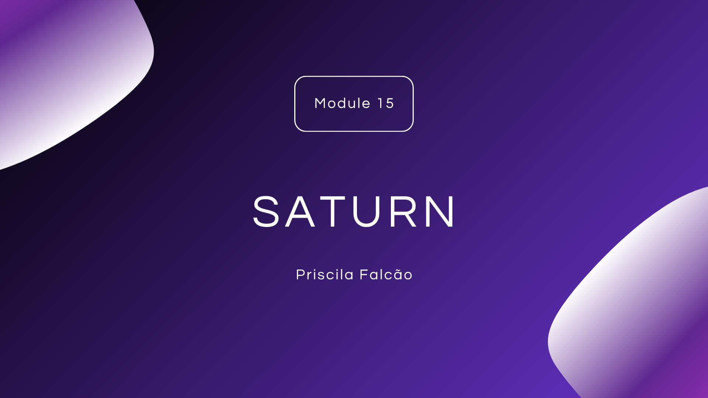

# Public Report

## Sprint 1

**Objective**: Establish the foundational structure and architecture of the module.

**Activities completed:**

- Developed the project plan for the module, including scope, deliverables, and initial timeline.

- Defined the class architecture, aligned with functional and non-functional requirements.
Reviewed and refined architecture diagrams to ensure clarity and compliance with project standards.

## Sprint 2

**Objective:** Design the user experience and finalize the system interface.

**Activities completed:**

- Mapped the user journey, identifying key touchpoints and primary user flows.

- Finalized the system’s user interface (UI/UX), prioritizing usability and alignment with end-user needs.

## Sprint 3

**Objective:** Integrate front-end and back-end functionalities.

**Activities completed:**

- Connected back-end features with the front-end interface.

- Validated communication between layers and resolved data exchange inconsistencies.

## Sprint 4

**Objective:** Enhance security measures and restructure the system architecture.

**Activities completed:**

- Refactored the codebase and decomposed the application into microservices to improve scalability and maintainability.

## Sprint 5

**Objective:** Finalize integrations, secure cross-origin requests, and validate data integrity.

- Configured CORS (Cross-Origin Resource Sharing) to securely allow requests to designated endpoints.

- Developed the Public Report, focusing on transparency and accessibility of key information.

## ▶️ Final Presentation

> Link: https://drive.google.com/drive/folders/1Oxy7LvQimWj6NdUSdGR5bImjxmv8EhdY?usp=sharing

## Slides

Available at: [Document](../business/module2.pdf)

<a href="./assets/module15_slides.pdf"></img></a>